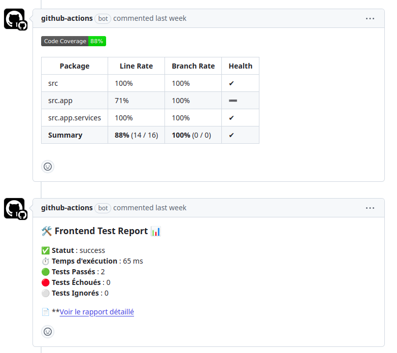

# BobApp

This is BobApp, an application that give you a joke, every day.

## Features

- Display a new joke every day
- Display a new joke with a button

## Installation

Git clone:

```
git clone https://github.com/leaandredev/P10_CI_CD
```

### Front-end 

Install dependencies:

> npm install

Launch Front-end:

> npm run start;

#### Docker

Build the container:

> docker build -t bobapp-front .  

Start the container:

> docker run -p 8080:8080 --name bobapp-front -d bobapp-front

### Back-end

Go inside folder the back folder:

> cd back

Install dependencies:

> mvn clean install

Launch Back-end:

>  mvn spring-boot:run

Launch the tests:

> mvn clean install

### Docker

Build the container:

> docker build -t bobapp-back .  

Start the container:

> docker run -p 8080:8080 --name bobapp-back -d bobapp-back 

## CI workflows

### Test and coverage

Path : [tests_coverage.yml](.github/workflows/tests_coverage.yml)

This worflow runs automatically on every push and pull request on main branch.
Test and coverage summary results are added in the PR comments :



### SonarQube

Path : Path : [sonarqube_scan.yml](.github/workflows/sonarqube_scan.yml)

This worflow runs automatically on every push and pull request on main branch.
It run a scan on added code, and on all project when PR is merge.

SonarQube cloud indentification variables must be set in this file for frontend : [sonar-project.properties](front/sonar-project.properties)

Ensure the following secrets are set in GitHub Actions:

**SONAR_TOKEN**: Token for Sonar identification.

## CD worflow

### Docker  Deploy

Path : [docker.yml](.github/workflows/docker.yml)

This worflow runs automatically on every push on main branch.
It build and deploy the application on a remote server.

Ensure the following secrets are set in GitHub Actions:

**DOCKERHUB_USERNAME**: Username on DockerHub plateform
**DOCKERHUB_TOKEN**: Private token for deployment

